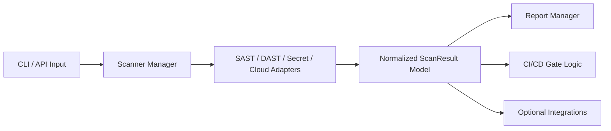

# SecFlow

Security orchestration framework for deterministic DevSecOps scan pipelines.

## Why this repo matters
SecFlow is designed as an integration layer across security scanners:
- run multiple scanners through one control surface
- normalize findings into a shared model
- generate reports for CI/CD quality gates
- support optional web and integration modules without hard dependency coupling

## Architecture


## Quick start
```bash
python -m venv .venv
.venv/bin/pip install -e '.[dev]'
.venv/bin/pytest -q
```

### Run scan
```bash
secflow scan ./ --scanner bandit --format json
```

## Quality controls
- CI pipeline runs tests on push and pull request.
- Optional modules are imported lazily to keep core package stable.
- Project excludes runtime cache artifacts from version control.

## Security
- Policy: `SECURITY.md`
- Threat model: `docs/THREAT_MODEL.md`

## Roadmap
See `docs/ROADMAP.md`.
