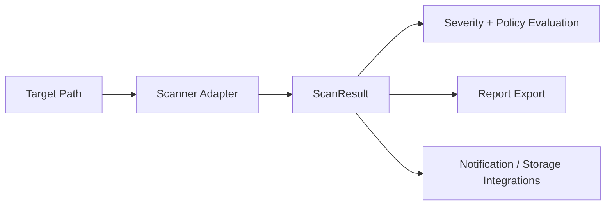

# Architecture

## Core
- `pyseckit/core/`: base scanner abstractions, finding model, config.
- `pyseckit/sast/`, `pyseckit/dast/`, `pyseckit/secret_scan/`, `pyseckit/cloud/`: scanner adapters.
- `pyseckit/reporting/`: report generation (JSON/HTML/CSV/XML).
- `pyseckit/cli.py`: command entrypoint for scan orchestration.

## Optional
- `pyseckit/web/`: Flask-based management endpoints and dashboard blueprint.
- `pyseckit/integrations/`: notification and Elasticsearch integration hooks.
- `pyseckit/plugins/`: extension mechanism for custom scanners.

## Data flow

